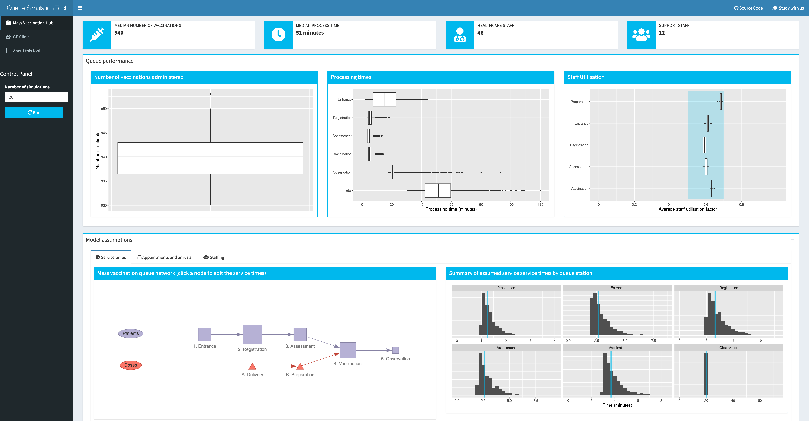

# Vaccine Queue Simulator

## About

This applet provides a graphical user interface to the mass vaccination and GP clinic queueing networks estimated with the R package `queuecomputer`. On accessing the applet in a web browser, the results from two default models are presented. These models have been parameterised to reflect the medium-sized baseline model presented here, i.e. the mass vaccination centre with 42 staff members and the GP clinic with eight staff members (see the related [scientific preprint article](https://doi.org/10.1101/2021.04.07.21255067) for more details). The interactive interface allows users to adjust the assumed arrival times, service times and available staff to reflect their own situation or assumptions. Queue performance is summarised in terms of total throughput, processing times and staff utilisation.

[Launch the app](https://cbdrh.shinyapps.io/queueSim/)

## Links
* View and download the latest version of the paper from [medRxiv](https://doi.org/10.1101/2021.04.07.21255067)
* Download the paper from [GitHub](https://github.com/CBDRH/vaccineQueue/blob/main/Preprint/Preprint.pdf) 
* Article in [The Conversation](https://theconversation.com/drafts/158519/) 
* The queueing network models implmented in this app are estimated using the  `queuecomputer` R package [Ebert, A., Wu, P., Mengersen, K., & Ruggeri, F. (2020). Computationally Efficient Simulation of Queues: The R Package queuecomputer. Journal of Statistical Software, 95(5), 1 - 29. doi:http://dx.doi.org/10.18637/jss.v095.i05](https://www.jstatsoft.org/article/view/v095i05) 
         
## Bug reports         
Bug reports and feature requests can be submitted through the [GitHub issues page](https://github.com/CBDRH/vaccineQueueNetworks/issues)

## Contributors

This applet was created by

* Mark Hanly
* Oisín Fitzgerald 
* [Tim Churches](Timchurches.github.io) 

## Acknowledgements

This research was supported by the generous assistance of Ian Sharp, philanthropic supporter of UNSW research, and by a research seed grant provided by the [Sydney Partnership for Health, Education, Research and Enterprise (SPHERE) 
                            Infectious diseases, Immunity and Inflammation (Triple-I) Clinical Academic Group](https://www.thesphere.com.au/work/infectious-disease-immunity-and-inflammation-triple-i)

## Acknowledgement of country

The Wangal, Bedegal and Gadigal people of the Eora Nation are the traditional owners of the land on which this work was undertaken. We acknowledge and pay our respects to their Elders, both past, present and emerging.
